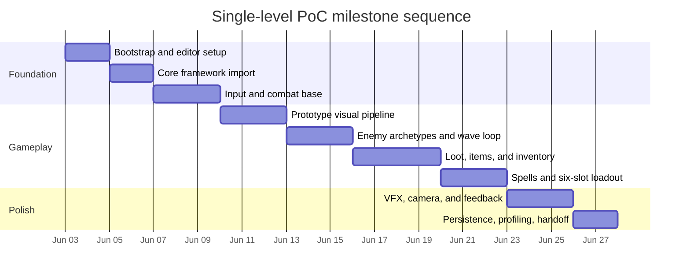

# Unity Asset Research Report for a Top-Down Vertical-Scrolling Wave-Survival Shooter

## Executive summary

For a polished, freelancer-friendly proof of concept, the strongest overall stack is **Unity 2022.3 LTS**, **TopDown Engine** as the gameplay backbone, **Unity Input System**, **Cinemachine**, **Unity 2D Animation + Sprite Swap + PSD Importer**, **Odin Inspector**, **Feel**, and a modular pixel-character pipeline built around **Character Creator – Fantasy** or **SPUM**. That recommendation is driven by three factors: current compatibility breadth, asset ecosystem maturity, and the fact that these tools already align with mainstream Unity GameObject workflows rather than forcing a custom architecture too early. TopDown Engine currently lists compatibility through Unity 6000.0 and 2022.3, includes top-down combat and inventory-oriented features in its ecosystem, exposes character abilities, weapons, loot, and events in documentation, and has a community extensions repository; Odin, Rewired, and Feel are also heavily adopted, while Unity’s official Input System, Cinemachine, Addressables, and 2D Animation packages remain the safest common-denominator standards for contractors. citeturn18view4turn31search1turn31search5turn31search9turn5search17turn4search15turn18view2turn18view3turn18view0turn8search6turn8search1turn9search3turn8search0

One important correction up front: **Pixel Art Top Down - Basic** is a **2D environment pack**, not a modular character setup or animation framework. Its Asset Store classification is “2D Environments,” and its related keywords are tiles, ruins, and environment pieces. It is a good baseline for your first **prototype level art**, but it should **not** be treated as your long-term character/equipment pipeline. If you want modular characters with helmet/chest/pants/weapon swaps, you need to pair that environment pack with a character creator and a sprite-swap workflow. citeturn19view1

The transition from an initial pixel-art prototype to a later higher-fidelity modular art set is **very manageable if you plan for it from day one**, and **painful if you do not**. Unity’s Sprite Swap system is specifically designed to change rendered sprites while keeping the **same skeleton rig and animation clips**, and Unity documents both **Sprite Library / Sprite Resolver** workflows and the ability to **add new sprites to an existing rig** later. That means the right strategy is to lock your **equipment slots, pivot/anchor conventions, naming rules, and animation-state contract** now, while treating the prototype art as just one visual skin over a stable runtime architecture. citeturn29search4turn29search3turn29search13turn9search15turn10search3

If your art choice remains heavily pixel-based for the first vertical slice, I recommend staying on **URP 2D** only if your chosen character pipeline explicitly supports it; otherwise, use **Built-in** for the proof of concept and migrate later. For example, **Character Creator – Fantasy** currently shows Built-in/URP/HDRP compatibility, while **Character Editor 4D [Megapack]** is listed as Built-in-only, and **Character Creator 2D** has a mixed matrix where URP is supported but HDRP is not, with some Built-in caveats on newer editor versions. That is why **2022.3 LTS** is the safest baseline for asset-store-heavy production, even though several recommended tools already show Unity 6 compatibility. citeturn20view0turn21view0turn22view0turn9search3turn10search3

For the **VS Code workflow**, Unity’s current guidance matters: Unity says the old **`com.unity.ide.vscode`** package is **no longer supported**, and that **`com.unity.ide.visualstudio`** now supports **Visual Studio Code** in addition to Visual Studio. Microsoft’s current **Unity for Visual Studio Code** extension builds on **C# Dev Kit** and **C#**. In practice, that means your durable setup is: Unity project configured with **Visual Studio Editor**, plus the **Unity** extension and **C# Dev Kit** in VS Code. citeturn35search9turn35search1turn35search7turn35search15

## Assumptions and decision criteria

This report assumes no hard constraint on platform, resolution, or render pipeline, and no firm requirement for online multiplayer in the proof of concept. Because your control scheme is mouse-centric and your immediate goal is a **single polished PoC level**, I am assuming a **desktop-first, keyboard-and-mouse primary build** with controller readiness, but **not** online networking in milestone one. The analysis therefore favors assets and packages that are easy to hand off to freelancers, easy to profile, and easy to replace later without rewriting combat systems.

I weighted asset choices around five criteria: **maintenance cadence**, **compatibility clarity**, **adoption / ecosystem familiarity**, **modular-equipment suitability**, and **how cleanly each tool fits a ScriptableObject-driven GameObject workflow**. That weighting strongly favors official Unity packages, More Mountains frameworks, Sirenix tools, and widely recognized pipelines like Sprite Swap and Spine, because those are the systems most likely to be understood by outside contractors and easiest to document. Where an asset page showed very recent releases or explicit Unity 6 / 2022.3 matrices, I treated that as a material advantage; where an asset had low review history or unclear pipeline coverage, I treated that as a risk signal. citeturn20view0turn21view0turn22view0turn18view4turn18view2turn18view0turn27view0

Prices below are **current list prices observed during research**. Unity Asset Store pages also note that taxes/VAT are calculated at checkout, and some pages showed active sale banners, so treat them as **point-in-time list prices**, not guaranteed future prices. citeturn20view0turn18view4turn18view2turn18view0

A sensible **purchase priority** for your project is: **TopDown Engine**, **Odin Inspector**, **Feel**, one **modular character pipeline** asset (**Character Creator – Fantasy** or **SPUM**), then targeted content packs and optional authoring/database tools. Networking should wait until after the single-level PoC unless co-op is confirmed as a hard requirement. citeturn18view4turn18view2turn18view0turn20view0turn27view0turn11search9

## Recommended production stack

The most pragmatic production path is to use **TopDown Engine** for movement, aiming, weapons, enemy-state architecture, and wave-combat scaffolding, then build your custom systems on top of its **Character Ability** pattern rather than reinventing a character stack. TopDown Engine’s docs explicitly position abilities, weapons, and events as core extension points, and its weapon handling already assumes a dedicated weapon-attachment transform on the character prefab. That fits your primary attack, secondary attack, and six-spell model well: keep **LMB** and **RMB** as “attack channels,” then implement the six spells as a custom **SpellCaster ability** backed by ScriptableObject spell definitions and cooldown state. citeturn31search5turn31search1turn31search9

For inventory and drops, the cleanest choice is to **stay inside the More Mountains ecosystem** for the PoC. More Mountains’ own site states that **Inventory Engine is included in TopDown Engine**, and its inventory/docs model items as ScriptableObjects that can be picked up, equipped, dropped, and saved. For your first PoC, that avoids the integration overhead of combining two separate commercial frameworks that both want to own similar concerns. The main case for choosing **Opsive Ultimate Inventory System** instead is if you already know that your project will lean heavily into deeper RPG inventory semantics such as richer shops, crafting, and a more inventory-first economy. citeturn5search17turn5search3turn5search7turn18view1

For modular visuals, my recommendation is to treat **Character Creator – Fantasy** and **SPUM** as the two best first-pass paid candidates, but for different reasons. **Character Creator – Fantasy** is the most attractive if you want a current, fantasy-specific creator with a modern compatibility matrix across Built-in/URP/HDRP. **SPUM** is the safer prototype choice if you want a strongly modular pixel-art workflow with an established ecosystem and optional paid resource bundles. In both cases, the part-swapping contract should be normalized onto Unity’s **Sprite Library / Sprite Resolver** system so you can later exchange the source art without reworking gameplay code. citeturn20view0turn27view0turn27view1turn29search3turn29search13

For polish, the “buy this early” tool is **Feel**. It is not a content pack; it is a responsiveness and feedback toolkit, and that matters for a wave-survival shooter because camera shake, hit flashes, cast anticipation, time pulses, and impact feedback are what make familiar mechanics feel expensive. More Mountains also documents direct feedback integration points inside TopDown Engine. Pair that with a small, style-appropriate effect pack—**Pixel Art Particles Pack** if the PoC remains visibly pixelated, or **Cartoon FX Remaster** if you are already moving toward a more stylized non-pixel fantasy look. citeturn18view0turn31search20turn13search2turn19view2

On the tooling side, **Odin Inspector** is the highest-value editor purchase for this project because your data model will quickly become object-heavy: items, rarities, modifiers, spell definitions, cooldown configs, loot tables, enemy archetypes, drops, and status effects all benefit from better inspector UX. If your content database later grows large enough that you want more of a structured authoring layer, **Databrain** is the best paid escalation path; if you want a lightweight free utility, **Scriptable Object Database** is a reasonable low-risk supplement. citeturn18view2turn34view0turn34view1

## Asset analysis and comparisons

**Core gameplay frameworks and inventory**

| Asset                         |    Price | Compatibility and SRP                                                                                             | Best fit for this game                                                                                      | Advantages                                                                                                                                                                                                           | Limits and risks                                                                                                                                               | Integration notes                                                                                                                           | Source                                                                                    |
| ----------------------------- | -------: | ----------------------------------------------------------------------------------------------------------------- | ----------------------------------------------------------------------------------------------------------- | -------------------------------------------------------------------------------------------------------------------------------------------------------------------------------------------------------------------- | -------------------------------------------------------------------------------------------------------------------------------------------------------------- | ------------------------------------------------------------------------------------------------------------------------------------------- | ----------------------------------------------------------------------------------------- |
| **TopDown Engine**            |  **$75** | Explicitly compatible on listed pages with **Unity 2019.4 / 2020.3 / 2022.3 / 6000.0**, **Built-in / URP / HDRP** | Best overall backbone for movement, aiming, combat loop, AI, wave logic, and weapon handling                | Mature usage footprint, explicit top-down shooter focus, character abilities, weapons, local multiplayer, event system, community extensions, and a More Mountains ecosystem that already includes inventory tooling | You adopt engine conventions; its default input path historically centers on legacy Input Manager, so you should intentionally switch to its Input System path | Use **CharacterHandleWeapon**, create a custom **SpellCaster** ability for spell slots, and use its event bus for loot/UI/combat decoupling | citeturn18view4turn31search1turn31search5turn31search9turn31search19turn4search15 |
| **Inventory Engine**          |  **$25** | Utility asset; original Unity version **2019.4.28**; render-pipeline concerns are not central                     | Standalone option if you do **not** use TopDown Engine, or want the same inventory stack in another project | ScriptableObject-based items, equip/drop/pickup flows, save/load docs, equipment inventory types                                                                                                                     | Redundant purchase if TopDown Engine is already your core framework, because More Mountains says it is included there                                          | Good fallback if you later split inventory tech out of TopDown Engine or want a smaller isolated sample project                             | citeturn32view0turn5search3turn5search7turn5search17                                |
| **Ultimate Inventory System** |  **$90** | Latest version **1.3.7**, latest release **May 29, 2026**, original Unity version **2022.1.0**                    | Strong alternative if the game becomes more inventory-heavy than combat-heavy                               | Clear item/inventory/crafting/shop orientation from asset metadata; actively updated                                                                                                                                 | More integration effort if paired with TopDown Engine; avoid running two overlapping commercial inventory paradigms at once                                    | Choose this **instead of** More Mountains inventory, not alongside it                                                                       | citeturn18view1                                                                        |
| **2D Game Kit**               | **Free** | Official Unity tutorial project; latest version **5.0**, latest release **Mar 23, 2026**                          | Useful only as a free reference/sample baseline                                                             | Free, official, good as a sample archive                                                                                                                                                                             | Not a strong fit for your vertical-scrolling twin-stick fantasy shooter production stack                                                                       | Use only as a learning/reference project, not the core framework                                                                            | citeturn28search10                                                                     |

**Modular character creators and equipment-swap candidates**

| Asset                                    |      Price | Compatibility and SRP                                                                                                                                                     | Best fit for this game                                                                              | Advantages                                                                                                        | Limits and risks                                                                                                                                           | Integration notes                                                                                                                        | Source               |
| ---------------------------------------- | ---------: | ------------------------------------------------------------------------------------------------------------------------------------------------------------------------- | --------------------------------------------------------------------------------------------------- | ----------------------------------------------------------------------------------------------------------------- | ---------------------------------------------------------------------------------------------------------------------------------------------------------- | ---------------------------------------------------------------------------------------------------------------------------------------- | -------------------- |
| **Character Creator – Fantasy**          | **$39.99** | Asset page lists **Unity 2022.3.27 / 6000.0.55 / 6000.3.0**, **Built-in / URP / HDRP compatible**                                                                         | Best paid first look if you want a fantasy-specific modular creator and future pipeline flexibility | Current compatibility matrix, low price, fantasy focus, modern release cadence                                    | Newer asset with only **5 reviews** and a smaller installed footprint than older creators, so production proof is lighter                                  | Use it as a parts source, then normalize output into your own slot schema and Sprite Library categories                                  | citeturn20view0   |
| **2D Pixel Unit Maker – SPUM**           | **$39.99** | Original Unity version **2022.3.62**, latest release **Apr 20, 2026**                                                                                                     | Best paid prototype candidate if you want a popular modular **pixel** workflow                      | Strong adoption signal for a niche pixel modular tool, active updates, an ecosystem of related packs              | Asset page snapshot does not expose a detailed SRP matrix; you still need to verify directional coverage and animation naming against your combat contract | Very good for prototype characters and equippable looks; combine with Sprite Library/Resolver if you want future art-source independence | citeturn27view0   |
| **Character Editor 4D [Megapack]**       | **$49.90** | Listed for **Unity 2022.3.62**, **Built-in compatible**, **URP/HDRP not compatible** on shown matrix                                                                      | Good option if you are comfortable staying **Built-in** during the PoC                              | Older and more battle-tested than some newer creators, “modular” explicitly appears in metadata, recently updated | Poor fit if you are standardizing on URP 2D; built-in-only is a real strategic constraint                                                                  | Only choose if its art/pipeline fit is compelling enough to justify a Built-in project baseline                                          | citeturn21view0   |
| **Character Creator 2D**                 |    **$30** | Page shows **URP compatible**, **HDRP not compatible**; on listed **6000.3.3** matrix Built-in is not compatible, while **2021.3.0** shows Built-in and URP compatibility | Budget modular 2D creator alternative                                                               | Lower cost, established review history, still maintained                                                          | Compatibility matrix is less straightforward than Character Creator – Fantasy; verify perspective match before committing                                  | A reasonable fallback if SPUM/CC-Fantasy art does not land for your game                                                                 | citeturn22view0   |
| **Pixel Units – SPUM Bundle Pack Basic** |   **Free** | Latest release **Mar 19, 2026**, original Unity version **2022.3.62**                                                                                                     | Best free modular pixel starter to pair with SPUM                                                   | Free way to test the SPUM workflow before buying the full ecosystem                                               | Limited content compared with paid SPUM bundles                                                                                                            | Use as a pipeline test before expanding into paid parts                                                                                  | citeturn24search4 |

**Pixel-art content packs and prototype art**

| Asset                                                                    |      Price | Compatibility and SRP                                                 | Best fit for this game                                                        | Advantages                                                            | Limits and risks                                                                                                         | Integration notes                                                                            | Source             |
| ------------------------------------------------------------------------ | ---------: | --------------------------------------------------------------------- | ----------------------------------------------------------------------------- | --------------------------------------------------------------------- | ------------------------------------------------------------------------------------------------------------------------ | -------------------------------------------------------------------------------------------- | ------------------ |
| **Pixel Art Top Down - Basic**                                           |   **Free** | Original Unity version **2021.3.15**                                  | Best first **environment** prototype pack                                     | Very lightweight, extremely easy to adopt, good for greybox-plus art  | It is **not** a character creator or animation setup                                                                     | Use it for map art only; do not anchor your equipment pipeline to it                         | citeturn19view1 |
| **TopDown HD Character pack – Animated 2D Pixel Characters**             |  **$9.99** | Active asset page, character-focused content                          | Cheap source of ready-made animated top-down characters                       | Very low cost, direct relevance to top-down pixel characters          | Less modular than a creator-centric workflow                                                                             | Good to populate enemies/NPCs quickly while your core player pipeline uses a modular creator | citeturn27view2 |
| **SPUM: Ultimate Resource Bundle Pack**                                  | **$99.99** | Original Unity version **2022.3.62**, latest release **Mar 19, 2026** | Best content expansion if you standardize on SPUM                             | Highest leverage purchase if SPUM becomes your prototype art standard | Tied to SPUM ecosystem value; unnecessary if you choose another creator                                                  | Buy only after you confirm SPUM is your chosen character pipeline                            | citeturn27view1 |
| **2D Cozy RPG – Farming – Tilesets – Characters – Pixelart MAIN BUNDLE** | **$59.99** | Broad pixel-art asset bundle                                          | Good bulk purchase if you need environments, characters, and world props fast | Strong breadth and value per asset, lots of favorites and reviews     | “Cozy RPG” look may need re-toning for a combat-heavy survival shooter                                                   | Better as a breadth booster than as a single-style bible                                     | citeturn27view3 |
| **Fantasy Topdown Pixel Art**                                            |  **$7.99** | Environment asset, original Unity version **2021.3.2**                | Low-cost backup environment source                                            | Cheap, thematically aligned                                           | Asset page explicitly includes a **Created with AI** flag, which may matter for style consistency and commercial comfort | Use only if you are comfortable with that workflow and have verified art coherence           | citeturn27view4 |

**Animation tools and 2D rigging**

| Tool                                                |                                         Price | Compatibility and SRP                                                                                                                                 | Best fit for this game                                                                                              | Advantages                                                                                                                                                                     | Limits and risks                                                                                                                                                                                                                                                      | Integration notes                                                                                             | Source                                                                                      |
| --------------------------------------------------- | --------------------------------------------: | ----------------------------------------------------------------------------------------------------------------------------------------------------- | ------------------------------------------------------------------------------------------------------------------- | ------------------------------------------------------------------------------------------------------------------------------------------------------------------------------ | --------------------------------------------------------------------------------------------------------------------------------------------------------------------------------------------------------------------------------------------------------------------- | ------------------------------------------------------------------------------------------------------------- | ------------------------------------------------------------------------------------------- |
| **Unity 2D Animation + Sprite Swap + PSD Importer** |                                      **Free** | **2D Animation 14.0.4** for Unity **6000.4**; **PSD Importer 13.0.3** for Unity **6000.4**                                                            | Best default modular-equipment pipeline for a Unity-native project                                                  | Official, contractor-friendly, Sprite Swap preserves skeleton and clips, Sprite Library/Resolver is purpose-built for part swaps, PSB import supports layered multipart actors | PSD importer targets **PSB** workflows; fewer high-end deformation features than Spine                                                                                                                                                                                | Make every equipment slot a Sprite Library category and use consistent labels across art sets                 | citeturn9search3turn29search4turn29search3turn29search13turn10search3turn10search13 |
| **Animancer Pro v8**                                |                                       **$90** | Asset Store tool; latest release visible, general animation runtime tool                                                                              | Best optional purchase if you want more code-driven animation control than Animator controllers                     | Cleaner runtime animation API than giant Animator graphs                                                                                                                       | Not mandatory if TopDown Engine + Animator already cover your PoC well                                                                                                                                                                                                | Add only if your animation-state logic becomes hard to maintain                                               | citeturn17view0turn14search6                                                            |
| **Spine Essential / Professional**                  |                                **$69 / $379** | Official runtime docs and downloads show broad Unity runtime support, including packages/add-ons compatible through **Unity 6000.4**                  | Best high-end external rigging tool if you later move beyond simple sprite swaps                                    | Premier 2D animation workflow, advanced meshes/constraints, addressables add-ons, long-lived external ecosystem                                                                | Additional DCC purchase and pipeline, and Spine’s own official forum notes that Unity’s built-in 2D animation generally performs better for many characters because it uses a more limited feature set and GPU skinning while spine-unity currently uses CPU skinning | Best reserved for hero characters, bosses, or a later art-upgrade phase rather than your first playable slice | citeturn15search0turn39search0turn39search1turn39search6                              |
| **Creature**                                        |            **$50 Basic / $99 upgrade to Pro** | Official pages describe the Unity-oriented tool and features, but the cited pricing/features pages do not expose a precise Unity-version matrix       | Niche but powerful alternative if you need procedural mesh deformation, path animation, or motion-transfer features | Strong feature set for deformations and procedural motion                                                                                                                      | Less standard in Unity freelancer circles than official 2D Animation or Spine, and compatibility validation should be part of your technical due diligence                                                                                                            | Good only if your art direction truly needs Creature’s specialty features                                     | citeturn14search11turn16search1turn16search10                                          |
| **Aseprite + Unity 2D Aseprite Importer**           | **$19.99** for Aseprite; importer is **free** | Unity’s Aseprite Importer supports `.ase` and `.aseprite`; package version **1.1.11** is released for **Unity 6000.0**, and **1.1.10** for **2021.3** | Best authoring tool for pixel effects, enemies, pickups, and UI anims                                               | Excellent pixel-art authoring, official importer, direct file import, exportable animation assets                                                                              | Not a modular actor/equipment system by itself; generated Animator Controllers are read-only until exported                                                                                                                                                           | Excellent companion tool even if your main player pipeline later migrates to PSB or Spine                     | citeturn38search6turn38search8turn37search2turn37search0turn37search5                |

**VFX, particles, and game-feel**

| Asset                             |    Price | Compatibility and SRP                                                                                       | Best fit for this game                                                      | Advantages                                                                                                                                              | Limits and risks                                                            | Integration notes                                                                     | Source                            |
| --------------------------------- | -------: | ----------------------------------------------------------------------------------------------------------- | --------------------------------------------------------------------------- | ------------------------------------------------------------------------------------------------------------------------------------------------------- | --------------------------------------------------------------------------- | ------------------------------------------------------------------------------------- | --------------------------------- |
| **Feel**                          |  **$50** | Explicitly listed compatible with **Built-in / URP / HDRP** for Unity **2019.4 / 2020.3 / 2022.3 / 6000.0** | Highest-value polish purchase for a combat prototype                        | Strong feedback tooling for hit feel, responsiveness, camera shake, haptics, and combat juice; More Mountains docs show direct use inside TDE workflows | Not a content pack; it adds polish systems, not final spell art             | Buy early and use it everywhere: hits, casts, pickups, rare drops, boss telegraphs    | citeturn18view0turn31search20 |
| **Cartoon FX Remaster**           |  **$30** | Asset page lists **Built-in / URP compatible**, **HDRP not compatible** on shown matrix                     | Best non-pixel stylized placeholder or later-upgrade fantasy effect library | Established pack, broad stylized effect range                                                                                                           | Can visually clash with strict pixel-art if used too early or too literally | Stronger fit once your game moves away from a strict low-res pixel look               | citeturn19view2                |
| **Pixel Art Particles Pack**      |  **$10** | Original Unity version **2019.4.40**                                                                        | Best particle pack while the PoC still looks explicitly pixel-art           | Style fit is much better than generic stylized spell packs in an early pixel prototype                                                                  | Smaller scope than big stylized VFX libraries                               | Use as your prototype spell/impact baseline, then swap later if the art style changes | citeturn13search2              |
| **Cartoon FX Remaster Free**      | **Free** | Free version of the Cartoon FX line                                                                         | Best free stylized fallback                                                 | Good no-cost placeholder if you defer paid VFX                                                                                                          | Same style mismatch risks for pixel art                                     | Safe for experimentation, not ideal as a long-term art bible in a pixel build         | citeturn12search2              |
| **Simple FX – Cartoon Particles** | **Free** | Free stylized particle pack                                                                                 | Good supplemental free fallback                                             | Free and simple                                                                                                                                         | Limited breadth                                                             | Use only if you are not yet buying Feel + a dedicated VFX pack                        | citeturn12search14             |

**Input, camera, data authoring, workflow, and networking**

| Tool                              |    Price | Compatibility and SRP                                                                            | Best fit for this game                                                                                        | Advantages                                                                                        | Limits and risks                                                                                              | Integration notes                                                                       | Source                                          |
| --------------------------------- | -------: | ------------------------------------------------------------------------------------------------ | ------------------------------------------------------------------------------------------------------------- | ------------------------------------------------------------------------------------------------- | ------------------------------------------------------------------------------------------------------------- | --------------------------------------------------------------------------------------- | ----------------------------------------------- |
| **Unity Input System**            | **Free** | Official package **1.19.0** released for **Unity 6000.4**                                        | Best default input path for a new mouse-aim top-down shooter                                                  | Unity explicitly recommends it over legacy Input Manager for new projects                         | If you use TopDown Engine, you need to switch deliberately onto its Input System path or write a thin adapter | Build action maps for Move, Aim, Primary, Secondary, Spell1–Spell6, Interact, Inventory | citeturn8search6turn8search19turn31search3 |
| **Rewired**                       |  **$45** | Latest version **1.1.63.1**, latest release **May 7, 2026**, original Unity version **2019.4.0** | Strong paid alternative if you want maximal controller maturity and rebinding flexibility                     | Very established input middleware with large adoption                                             | Another input abstraction layer to integrate and document                                                     | Only worth adding if your controller/rebinding needs outgrow Unity Input System         | citeturn18view3                              |
| **Cinemachine**                   | **Free** | Official package **3.1.6** for **Unity 6000.4**; supports orthographic/2D usage                  | Best camera system for follow, framing, and screen-edge containment                                           | Official, mature, 2D-ready, easy to hand off                                                      | Multiple blended virtual cameras can briefly break perfect pixel rendering during transitions                 | Pair with Pixel Perfect extension if you keep a crisp pixel-art camera                  | citeturn8search1turn8search8turn33search17 |
| **Addressables**                  | **Free** | Official package; current docs describe address-based asset organization/loading                 | Best content-management layer for item icons, spell prefabs, variant skins, and future DLC-like content swaps | Decouples data from hard scene references and scales better than Resources folders                | Adds build-process discipline and content-group management overhead                                           | Use early for icons, VFX prefabs, character skins, and later art-set swaps              | citeturn8search0turn8search20turn8search10 |
| **Odin Inspector and Serializer** |  **$55** | Official Asset Store entry shows compatibility at least from **2019.4.39**, all pipelines        | Best paid productivity tool for your item/spell/loot data authoring                                           | Industry-standard inspector improvement, high freelancer familiarity, major quality-of-life gains | Non-standard EULA and some onboarding cost for contractors who have never used Sirenix tools                  | Very high ROI for this project’s data volume                                            | citeturn18view2                              |
| **Databrain**                     |  **$70** | Asset page lists **2022.3.42**, **Built-in / URP / HDRP compatible**                             | Best paid “structured item database” escalation path                                                          | Purpose-built data framework, good fit for larger data-driven projects                            | Extra abstraction layer; overkill for a tiny PoC                                                              | Add when your ScriptableObject collection becomes hard to manage manually               | citeturn34view0                              |
| **Scriptable Object Database**    | **Free** | Asset page lists **6000.1.15**, all pipelines compatible                                         | Best free lightweight database helper                                                                         | No-cost organization tool                                                                         | Much lighter than Odin + Databrain                                                                            | Use as a helper, not as the foundation of your runtime architecture                     | citeturn34view1                              |

If you later decide to add multiplayer, defer the decision until after the single-level vertical slice. **TopDown Engine** already includes **local** multiplayer support but states that networked multiplayer would require extra implementation. For online play, the most sensible shortlist is: **FishNet** if you want a free/open-source, feature-rich community option; **Netcode for GameObjects** if you want Unity’s official high-level GameObject stack; **Mirror** if you want a long-running free open-source option with strong ecosystem familiarity; and **Photon Fusion** if you want a free SDK plus a managed cloud path, noting Photon’s public pricing currently starts with a free **100 CCU** tier and then paid bundles beyond that. For your present brief, I would **not** import any networking stack yet. citeturn31search19turn11search0turn11search4turn11search9turn11search7turn11search15turn11search14turn11search2turn11search18

## Build plan

The build plan below assumes the recommended path: **Unity 2022.3 LTS**, **VS Code**, **TopDown Engine**, **Unity Input System**, **Cinemachine**, **2D Animation**, **Odin**, **Character Creator – Fantasy or SPUM**, **Pixel Art Top Down - Basic**, **Feel**, and More Mountains inventory/loot patterns. Where a tool is marked optional, that means I would explicitly **defer it until the checkpoint before it pays for itself**.

| Milestone                               | Packages to import at this step                                                                                                                                     | Key implementation tasks                                                                                                                                                                  | Testing checkpoint                                                                                            | Estimated effort |
| --------------------------------------- | ------------------------------------------------------------------------------------------------------------------------------------------------------------------- | ----------------------------------------------------------------------------------------------------------------------------------------------------------------------------------------- | ------------------------------------------------------------------------------------------------------------- | ---------------: |
| **Project bootstrap**                   | Unity **2022.3 LTS**, **com.unity.ide.visualstudio**, **Input System**, **Cinemachine**, **2D Animation**, **PSD Importer**, **2D Pixel Perfect**, **Addressables** | Create repo, configure external editor, install **Unity** + **C# Dev Kit** in VS Code, set asmdefs, create `Bootstrap` and `PoC_Level01` scenes, define sorting layers and physics layers | Scripts open from Unity into VS Code; breakpoints hit; action map asset exists; project compiles cleanly      |        **4–6 h** |
| **Core framework import**               | **TopDown Engine**, **Odin Inspector**                                                                                                                              | Import engine into clean baseline, verify sample scenes compile, create project config assets, strip demo content, switch player template to your game layers and rules                   | One player moves and aims in an empty test room with no console errors                                        |       **6–10 h** |
| **Input and twin-stick combat base**    | No new packages unless **Rewired** is chosen instead of Input System                                                                                                | Wire actions for Move, Aim, Primary, Secondary, Spell1–Spell6, Inventory, Interact; switch TDE to Input System path; create primary projectile attack and secondary attack channel        | Mouse aim, WASD movement, LMB/RMB attacks, basic cooldown gating all work                                     |       **8–12 h** |
| **Prototype visual pipeline**           | **Pixel Art Top Down - Basic**, **Character Creator – Fantasy** or **SPUM**                                                                                         | Build player visual prefab hierarchy, define slot transforms and sorting orders, create initial equipment categories, sprite libraries, and labels                                        | Runtime swaps for helmet, chest, pants, and weapon do not break animation visibility or ordering              |      **10–14 h** |
| **Enemy archetypes and wave loop**      | No new packages                                                                                                                                                     | Build 3 enemy archetypes, spawn manager, wave definitions, death flow, hit reactions, damage numbers or feedback hooks                                                                    | One full wave survives from start to finish; enemy count settles correctly; no deadlocks in spawn logic       |      **10–14 h** |
| **Loot, items, and inventory**          | Use TDE / More Mountains inventory and loot systems already imported; optionally add **Scriptable Object Database**                                                 | Create item definitions, loot tables, enemy drop rules, pickup prefabs, equipment slots, and a simple inventory/equipment UI                                                              | Enemies drop items; pickups can be collected; equipping changes stats and visuals                             |      **12–18 h** |
| **Spells and six-slot loadout**         | No new package required; optionally add **Databrain** if authoring becomes cumbersome                                                                               | Implement `SpellDefinition` data, quickbar UI, cooldown displays, per-slot casting, cast locks, and spell VFX hooks                                                                       | Six spell slots cast independently; cooldowns and UI states are always correct under stress                   |      **12–16 h** |
| **Polish pass**                         | **Feel**, **Pixel Art Particles Pack**, optional **Cartoon FX Remaster**                                                                                            | Add hit-stop, camera shake, screen flash, cast anticipation, pickup feedback, rare-drop feedback, enemy death juice, autoscroll camera logic, and audiovisual readability polish          | Combat feels responsive; effects are readable under many enemies/projectiles; camera motion feels intentional |      **10–14 h** |
| **Persistence, profiling, and handoff** | Optional **Databrain**, optional **Odin Validator**                                                                                                                 | Save/load inventory and spell loadout, add validation rules, profile wave stress test, write prefab/data conventions for contractors                                                      | Cold start into PoC scene works; save/load restores expected state; no critical spikes in normal wave load    |       **8–12 h** |

A realistic solo estimate for this single-level PoC is therefore about **80–116 hours** at an experienced Unity-indie pace, or **100–140 hours** if you include iteration and first-pass UI polish. The biggest time sinks are not movement or shooting; they are **data consistency**, **equipment-slot correctness**, and **feedback polish**.



## Migration path from the first pixel-art pass to higher-fidelity modular art

The clean migration path is to treat your prototype art as a **replaceable skin**, not as the place where gameplay truth lives. Unity’s **Sprite Swap** system is explicitly intended to let you change the rendered sprite while keeping the same rig and animation clips, and Unity also documents how to **add new sprites to an existing rig**. If you later move to layered PSB-based characters, Unity’s **PSD Importer** is aimed at creating multipart “actors” for the **2D Animation** package. If you later move to Spine, the official runtime and even Addressables add-ons already exist. Put differently: the migration challenge is not “can Unity do it?”; it is “will your own slot, pivot, and animation contracts be stable enough that Unity can do it cleanly?” citeturn29search4turn9search15turn10search3turn10search13turn39search0

The hardest technical issues are predictable. First is **direction-set mismatch**: if your prototype uses 4-direction or limited-direction sprites but your final art expects 8-direction locomotion, aim, hit, cast, and death states, the real cost appears later in animation mapping. Second is **pivot and attachment drift**: helmets, armor, sleeves, weapons, and spell sockets all need stable attachment references; TopDown Engine’s weapon docs already assume a dedicated **weapon attachment transform**, and your own visual hierarchy should do the same for torso, head, back, feet, and cast-origin anchors. Third is **camera and scale drift**: pixel prototypes are often authored around strict PPU assumptions, while later higher-fidelity art may want different scale and filtering; Unity’s Pixel Perfect docs make it clear that PPU, filter mode, compression, and pivot preparation materially affect output. Fourth is **collider drift**: keep colliders and hurtboxes independent from your rendered art, because Unity’s own collider docs note that colliders do not need to match the visual object exactly. citeturn31search1turn33search4turn33search13turn36search21

The practical way to make the later transition easy is to define these contracts now and refuse to break them later:

| Migration risk              | What breaks if ignored                                           | What to standardize now                                                                                                          |
| --------------------------- | ---------------------------------------------------------------- | -------------------------------------------------------------------------------------------------------------------------------- |
| **Equipment slots**         | Gear-swaps become custom one-offs per art set                    | Stable enum such as `Helmet`, `Hair`, `Face`, `Chest`, `Gloves`, `Pants`, `Boots`, `Cape`, `MainHand`, `OffHand`, `Back`, `Aura` |
| **Animation contract**      | Every freelancer names clips differently; state machines explode | Fixed clip/state names such as `Idle_N`, `Move_N`, `Move_NE`, `CastPrimary_N`, `CastSpell_NE`, `Hit_E`, `Death_S`                |
| **Anchor points**           | Weapons and helmets float or clip when art changes               | Transform names like `AimPivot`, `WeaponAttach`, `Muzzle`, `HeadAttach`, `BackAttach`, `FeetRoot`                                |
| **Sorting rules**           | Helmet/chest/cape overlap breaks between anim frames             | Stable sorting-layer or order recipe for front/back body pieces                                                                  |
| **Sprite-library taxonomy** | Runtime swaps become hardcoded sprite references                 | One `SpriteLibraryAsset` category per slot; labels are item-variant keys                                                         |
| **Scale and pivots**        | New art needs scene-by-scene retuning                            | PPU standard, pivot rules, and import preset per art family                                                                      |
| **Gameplay volumes**        | Final art forces retuning of damage/contact                      | Keep hurtboxes, hitboxes, pickup radii, and cast origins separate from visual meshes/sprites                                     |

If you expect **many** simultaneous enemies on screen, a second migration choice matters: **official Unity 2D Animation is the safer long-term default than Spine** unless you know you need Spine’s advanced mesh and constraints. That is because Spine’s own official forum notes that Unity’s built-in 2D animation generally performs better for many characters due to its more limited feature set and GPU skinning, whereas spine-unity currently uses CPU skinning. For a wave-survival title, that is highly relevant. My advice is simple: **use official 2D Animation + Sprite Swap as default**, then reserve Spine for hero characters, bosses, or a future art-upgrade phase only if the feature gain clearly justifies the runtime tradeoff. citeturn39search6

## Architecture and project structure

For this project, I strongly recommend **GameObject / MonoBehaviour + ScriptableObject** as the core architecture, not ECS. Unity’s official docs say the **Entities/ECS workflow differs** from the normal Unity OOP/GameObject workflow and is typically used together with multiple DOTS-related packages, while Unity’s ordinary GameObject model remains the fundamental object model for scenes. Since essentially every asset recommended above is built around MonoBehaviours, prefabs, and inspectors, a GameObject architecture is the shortest path to a stable freelancer-friendly PoC. If you later profile into extreme projectile or enemy counts, you can isolate a single swarm subsystem for data-oriented optimization instead of rebuilding the whole game in ECS. citeturn36search3turn36search7turn36search12turn36search18

The runtime pattern should be:

- **Domain data** in **ScriptableObjects**: items, spells, enemies, waves, rarities, loot tables, buffs.
- **Runtime state** in plain C# classes/structs: cooldown timers, inventory contents, loadouts, wave state.
- **Scene actors** as prefabs and MonoBehaviours: player controller, enemy brains, pickups, projectiles.
- **Communication** through an event layer: either TDE’s event system for local engine events or your own typed C# domain events for UI/save systems.
- **Visualization** isolated behind a `CharacterVisualController` that only knows slot keys, animation state, aim direction, and damage flash state.
- **Persistence** separate from item definitions: the save file should store IDs, stack counts, equipped IDs, and spell-slot bindings, not duplicated full data objects.

Unity’s own ScriptableObject docs reinforce the right mental model here: ScriptableObjects are for storing data as assets in the project and centralizing shared data, not for runtime save-state ownership in shipped builds. That maps perfectly to item/spell definitions versus per-run inventory state. citeturn30search0turn30search1turn30search2

A recommended folder structure is:

```text
Assets/
  _Project/
    Art/
      Characters/
      Equipment/
      Environments/
      VFX/
      UI/
    Audio/
      Music/
      SFX/
    Data/
      Items/
      Spells/
      Enemies/
      Waves/
      LootTables/
      StatusEffects/
      Addressables/
    Materials/
    Prefabs/
      Characters/
      Enemies/
      Projectiles/
      Pickups/
      UI/
      VFX/
    Scenes/
      Bootstrap/
      Gameplay/
      Test/
    Scripts/
      Core/
      Combat/
      Characters/
      Inventory/
      Spells/
      Enemies/
      UI/
      Data/
      Save/
      Tools/
    Animation/
      Controllers/
      Clips/
      SpriteLibraries/
      PSB/
    Settings/
      Input/
      Layers/
      Tags/
      Rendering/
    ThirdParty/
      MoreMountains/
      Sirenix/
      Opsive/
      Spine/
```

A recommended **item definition** schema for this game looks like this:

| Field               | Type                     | Purpose                                          |
| ------------------- | ------------------------ | ------------------------------------------------ |
| `Id`                | string / GUID            | Stable save/load key                             |
| `DisplayName`       | Localized string ref     | UI name                                          |
| `ItemType`          | enum                     | Consumable, Equipment, Currency, Quest, Material |
| `EquipmentSlot`     | enum / nullable          | Helmet, Chest, Pants, MainHand, etc.             |
| `Rarity`            | enum                     | Common to Legendary                              |
| `MaxStack`          | int                      | Stack rules                                      |
| `Icon`              | Sprite / Addressable ref | Inventory UI                                     |
| `WorldPickupPrefab` | AssetReferenceGameObject | Drop and world pickup                            |
| `EquipVisualLabel`  | string                   | Sprite Library label or art-skin key             |
| `StatModifiers`     | list                     | Damage, defense, cast speed, crit, etc.          |
| `DropWeight`        | int                      | Convenience authoring value                      |
| `SellValue`         | int                      | Economy support                                  |
| `Tags`              | list of strings          | Filtering/querying                               |

A recommended **spell definition** schema looks like this:

| Field              | Type                     | Purpose                                        |
| ------------------ | ------------------------ | ---------------------------------------------- |
| `Id`               | string / GUID            | Stable save/load key                           |
| `DisplayName`      | Localized string ref     | UI name                                        |
| `SpellSchool`      | enum                     | Fire, Ice, Arcane, Nature, Holy, etc.          |
| `SlotCategory`     | enum                     | Utility, Damage, Dash, Summon, Aura            |
| `CooldownSeconds`  | float                    | Cooldown logic                                 |
| `Charges`          | int                      | Optional charge model                          |
| `ResourceCost`     | float                    | Mana/stamina/energy                            |
| `CastTime`         | float                    | Channel/lock timing                            |
| `AimMode`          | enum                     | Cursor, Self, Cone, Directional, Ground-target |
| `ProjectilePrefab` | AssetReferenceGameObject | Spawned attack object                          |
| `ImpactVfxKey`     | string                   | VFX lookup                                     |
| `CastAnimationKey` | string                   | Animation state or label                       |
| `InterruptPolicy`  | enum                     | Can move, can attack, can cancel               |
| `UpgradePath`      | list / refs              | Future progression hooks                       |

For modular equipment swaps, the visual stack should use **Sprite Library categories** like `Helmet`, `Chest`, `Pants`, `MainHand`, `OffHand`, and `Back`, while each item’s `EquipVisualLabel` becomes the resolver label. Unity’s Sprite Resolver API exists specifically to update a SpriteRenderer based on category/label, so your equipment system should change labels, not directly assign arbitrary sprite references. That gives you a single stable bridge between design data and art implementation. citeturn29search3turn29search5turn29search11

## Freelancer integration standards

Freelancer integration becomes easy when your project is opinionated. The simplest way to make outside help productive is to define a **small contract document** and enforce it in prefabs, names, and folders instead of explaining everything ad hoc. Use **assembly definitions** to separate modules, keep **third-party packages isolated under `ThirdParty/`**, and forbid direct modifications to vendor code. Put all game-facing integration points in your own adapter layer, not inside imported assets.

The minimum standards I would hand to any contractor are:

| Area                | Standard                                                                                                                         |
| ------------------- | -------------------------------------------------------------------------------------------------------------------------------- |
| **Prefab contract** | Every character prefab has `Root`, `VisualRoot`, `AimPivot`, `WeaponAttach`, `Muzzle`, `FeetShadow`, `HurtboxRoot`, `HitboxRoot` |
| **Slot names**      | Use only approved slot enums and Sprite Library categories; no custom one-off slot names                                         |
| **Animation names** | Fixed directional naming matrix; zero abbreviations beyond agreed compass codes                                                  |
| **Sorting**         | Document sorting layers and per-slot order offsets in one shared table                                                           |
| **Data IDs**        | All items, spells, enemies, and waves use stable string/GUID IDs; never save by display name                                     |
| **Script style**    | One class per file, assembly definitions per module, no circular references between UI and combat                                |
| **Third-party use** | Vendor code is read-only; extensions go through wrapper/adapters in `_Project/Scripts/Integration/`                              |
| **Validation**      | New content must pass Odin validation or equivalent pre-commit checks                                                            |
| **Scene hygiene**   | Only bootstrap scene loads managers; gameplay scenes contain scene-local content only                                            |
| **Documentation**   | Every contractor-facing subsystem has one short README with setup steps, naming rules, and “do not edit” zones                   |

If you want the project to remain contractor-friendly as it grows, prefer **prefab variants**, **ScriptableObject definitions**, **Sprite Library contracts**, and **clearly documented animation state machines** over code that wires everything by scene references. That approach is especially important for modular characters: if artists know the slot names, pivot contract, sprite-library categories, and sorting order rules, they can deliver compatible helmets/chests/pants/weapons without ever touching gameplay scripts. Unity’s own Sprite Library and Sprite Resolver workflows are designed for exactly that style of separation. citeturn29search3turn29search13

The final practical recommendation is this: for your first highly polished PoC, do **not** try to optimize for every possible future direction at once. Optimize for **one strong vertical slice** built on a stable, standard stack. In your case that means **TopDown Engine + official Unity packages + Odin + Feel + a modular character creator + a Sprite Library contract**. If you make those choices now, moving from prototype pixel art to a later modular art upgrade is not a rewrite; it is mostly a content pipeline exercise. citeturn18view4turn18view2turn18view0turn29search4turn9search15
